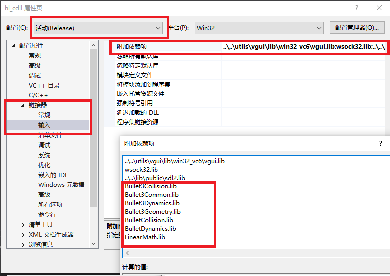
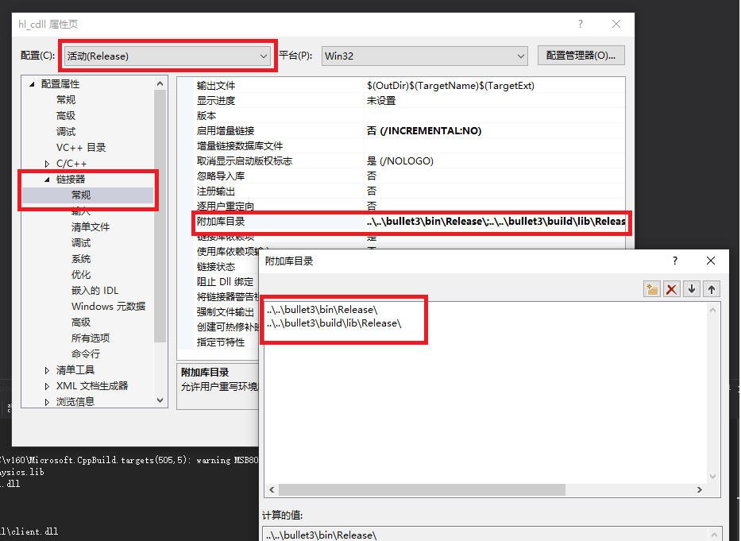
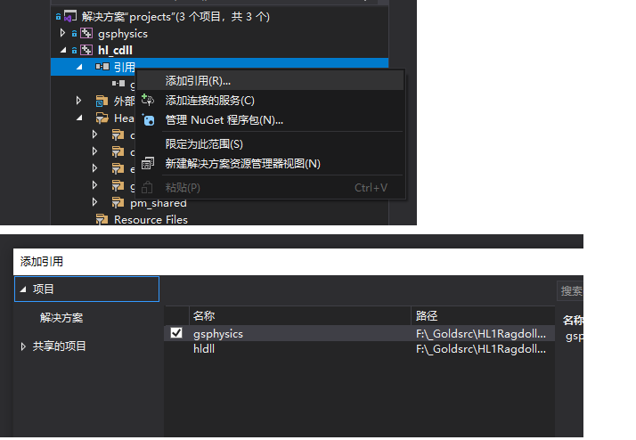

# gsphysics
Native implementation of GoldsrcPhysics

Mod that use this lib: [Half-Life Ragdoll](https://github.com/anchurcn/HL1RagdollMod-goldsrc)
## Usage

### Prerequisites
* VS 2019
* cmake

### Steps
Download these two repos [bullet3](https://github.com/bulletphysics/bullet3) 和 [gsphysics](https://github.com/anchurcn/gsphysics) 
,and place them in your HLSDK directory like this. If you have a different folder structure, then you have some extra work to do. If you don't know how to, submit issues.


Simply put, it is your client project, for HL it is hl_cdll, which needs to depend on some static link libraries.
One is gsphysics, which provides you with ragdoll support, and the other is bullet3 related libraries, which provides physics calculation support for gsphysics.

Let's proceed to set up the solution.

Since bullet3 does not need to be changed frequently, we directly use the script to compile it into a static library.
From [Half-Life Ragdoll](https://github.com/anchurcn/HL1RagdollMod-goldsrc)
Download these two scripts `build-bullet3-debug.bat` and `build-bullet3.bat` in your HLSDK directory,
Use VS 2019 dev prompt to run the script to build bullet3.
One is to build the release version, and the other is to build the debug version. Wait for the script to finish running.

Then in the hl_cdll project, add the following items as additional dependencies for debugging configuration and release configuration respectively


* debug：
```
Bullet3Collision_Debug.lib
Bullet3Common_Debug.lib
Bullet3Dynamics_Debug.lib
Bullet3Geometry_Debug.lib
BulletCollision_Debug.lib
BulletDynamics_Debug.lib
LinearMath_Debug.lib
```
* release
```
Bullet3Collision.lib
Bullet3Common.lib
Bullet3Dynamics.lib
Bullet3Geometry.lib
BulletCollision.lib
BulletDynamics.lib
LinearMath.lib
```
Then provide a path to find these additional dependencies.



For gsphysics, because we may need to modify it during development, we add it to our solution.
Right click on the solution and add the existing project `gsphysics/proj/gsphysics.vcxproj`


Then add the project reference gsphysics in the hl_cdll project. After doing this, gsphysics will be compiled when the hl_cdll project is generated, and then it will be used as a link input in the link phase.



In this way, our project can link these libraries during the linking phase.

Next, set and add the gsphysics header file include directory.
We need to include gsphysics header files for development, so we need to tell vs where the header files are.


Now we can use gsphysics.