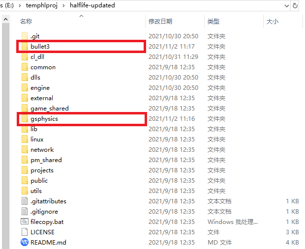
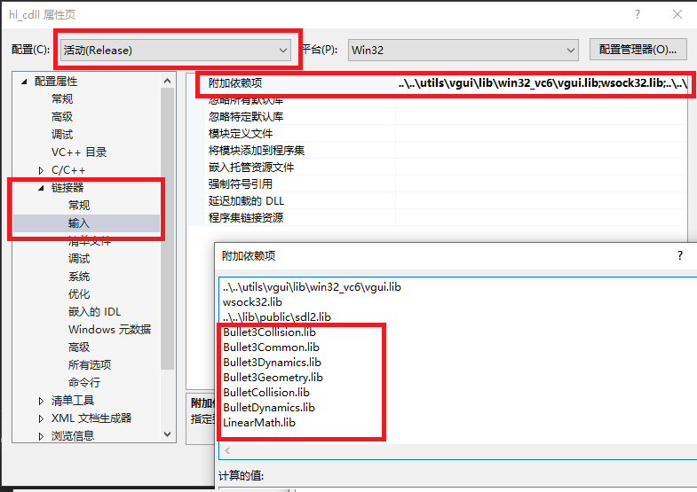
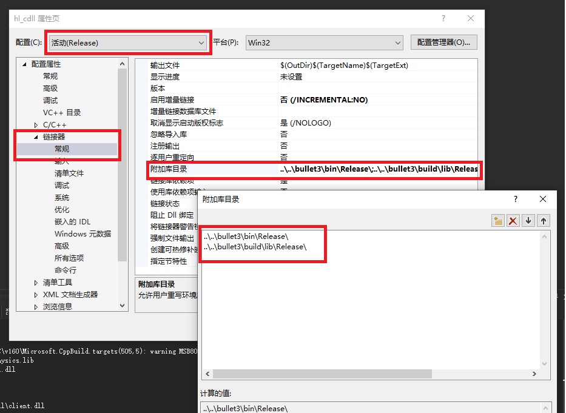
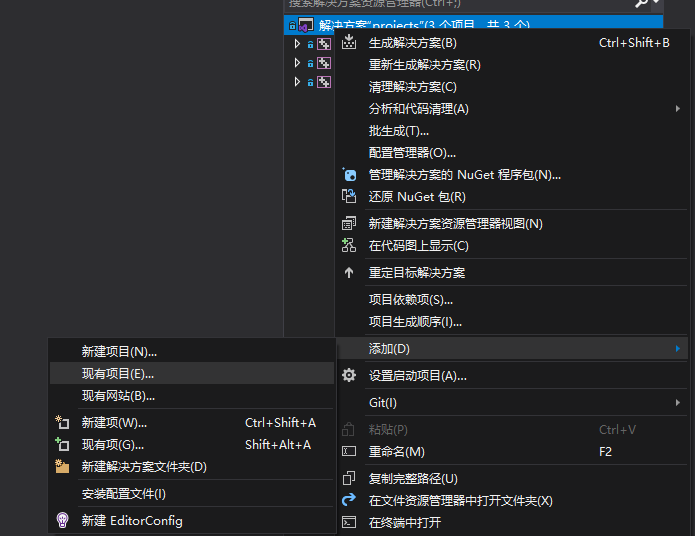
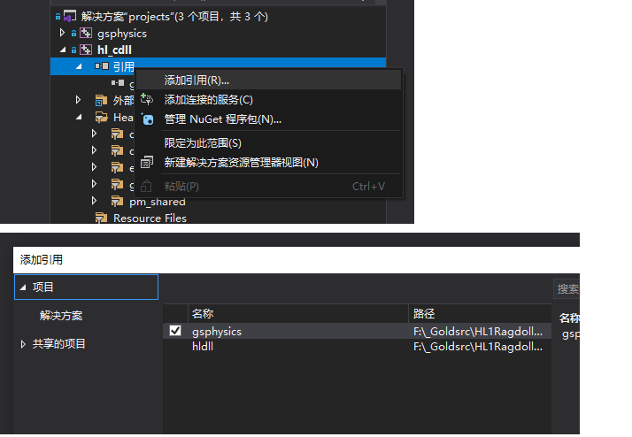
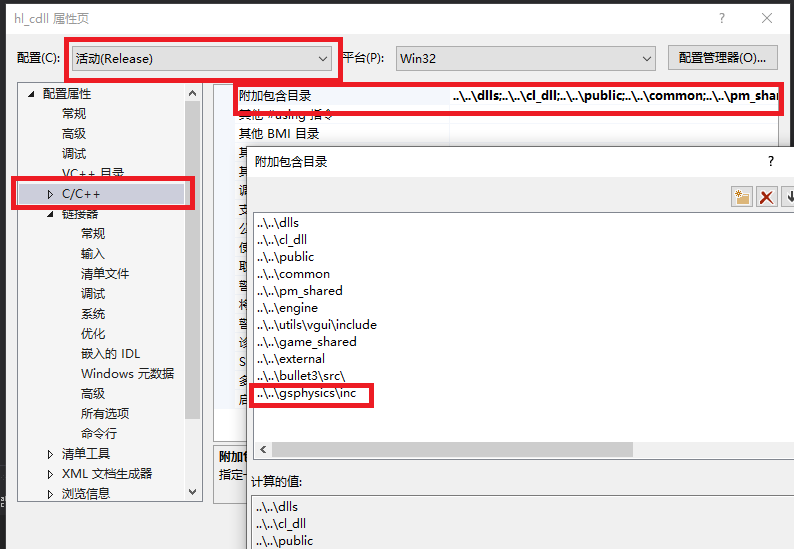

# gsphysics
GoldsrcPhysics 的 C++ 实现

具体用法也可以参考使用了这个库的 MOD: 

[Half-Life Ragdoll](https://github.com/anchurcn/HL1RagdollMod-goldsrc)
## 用法

### 先决条件
* VS 2019
* cmake

### 步骤
下载 [bullet3](https://github.com/bulletphysics/bullet3) 和 [gsphysics](https://github.com/anchurcn/gsphysics) 
两个仓库，像这样放置在你的 HLSDK 目录下。如果你有不一样的文件夹结构，那你有一些额外的工作要做了，有不明白的可以提 issue。




简单地来说呢就是你的客户端项目，对HL来说就是hl_cdll，需要依赖一些静态链接库，
一个是 gsphysics，为您提供布娃娃的支持，另一些是 bullet3 的相关库，为 gsphysics 提供物理演算支持。

下面我们来着手设置解决方案。

由于 bullet3 不需要经常变动，我们直接使用脚本编译成静态库。
从[Half-Life Ragdoll](https://github.com/anchurcn/HL1RagdollMod-goldsrc)
下载这两个脚本`build-bullet3-debug.bat`和`build-bullet3.bat`在您的HLSDK目录下，
使用 VS 2019 dev prompt 运行脚本构建 bullet3.
一个是构建发布版本的，一个是构建调试版本的。等待脚本运行完成。

然后在 hl_cdll 项目中将下面的项分别为调试配置和发布配置添加为附加依赖项


* 调试版本：
```
Bullet3Collision_Debug.lib
Bullet3Common_Debug.lib
Bullet3Dynamics_Debug.lib
Bullet3Geometry_Debug.lib
BulletCollision_Debug.lib
BulletDynamics_Debug.lib
LinearMath_Debug.lib
```
* 发布版本
```
Bullet3Collision.lib
Bullet3Common.lib
Bullet3Dynamics.lib
Bullet3Geometry.lib
BulletCollision.lib
BulletDynamics.lib
LinearMath.lib
```
然后提供查找这些附加依赖项的路径。



对于 gsphysics，因为我们可能在开发时需要修改，所以将它添加到我们的解决方案中。
右键点击解决方案，添加现有项目 `gsphysics/proj/gsphysics.vcxproj`



然后在 hl_cdll 项目中添加项目引用 gsphysics。这样子做后在hl_cdll项目生成的时候会编译 gsphysics，然后链接阶段会将其作为链接输入项。



这样我们的项目就能在链接阶段链接这些库了。

接下来设置添加 gsphysics 头文件包含目录。
我们开发需要包含 gsphysics 的头文件，所以我们要告诉vs头文件在哪。



现在我们就可以使用 gsphysics 了。